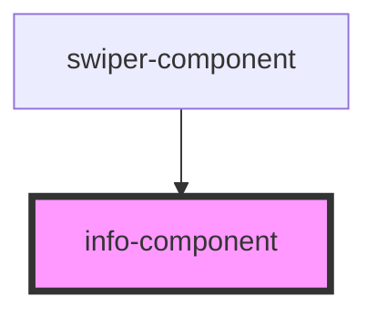

# info-component

<!-- Auto Generated Below -->

## Properties

| Property      | Attribute      | Description | Type     | Default     |
| ------------- | -------------- | ----------- | -------- | ----------- |
| `amountValue` | `amount-value` |             | `string` | `undefined` |
| `footerText`  | `footer-text`  |             | `string` | `undefined` |

## Events

| Event         | Description | Type               |
| ------------- | ----------- | ------------------ |
| `editTrigger` |             | `CustomEvent<any>` |

## Dependencies

### Used by

 - [swiper-component](../swiper-component)

### Graph

----------------------------------------------

*Built with [StencilJS](https://stenciljs.com/)*
