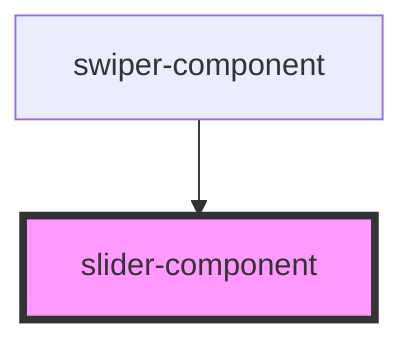

# slider-component

<!-- Auto Generated Below -->

## Properties

| Property        | Attribute        | Description | Type     | Default     |
| --------------- | ---------------- | ----------- | -------- | ----------- |
| `currentChoice` | `current-choice` |             | `any`    | `undefined` |
| `footerText`    | `footer-text`    |             | `string` | `undefined` |

## Dependencies

### Used by

 - [swiper-component](../swiper-component)

### Graph

----------------------------------------------

*Built with [StencilJS](https://stenciljs.com/)*
