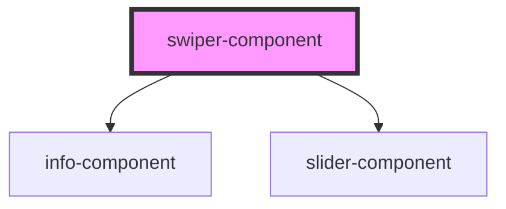

# swiper-component

<!-- Auto Generated Below -->

## Dependencies

### Depends on

- [info-component](../info-component)
- [slider-component](../slider-component)

### Graph

----------------------------------------------

*Built with [StencilJS](https://stenciljs.com/)*
